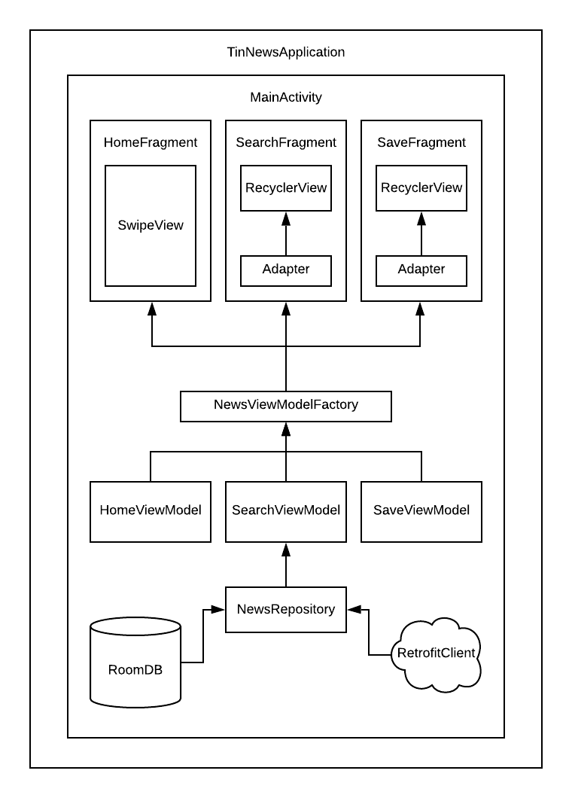

# TL;DR
This is an Android mobile app built in MVVM pattern supporting swipe gestures to like or dislike news. Within the app, users can:
- Swipe right to like (and save) news articles, swipe left to dislike 
- View all saved articles in snippets
- Expand each article to see full details 
- Search news articles by keywords 


## Behind the scenes 
### Component diagram


Three fragments are created to achieve the three main use cases. The ```HomeFragment``` implements ```SwipePlaceHolderView``` and presents a stack of newscards on top responsive to the swpie gesture. Both ```SaveFragment``` and ```SearchFragment``` implement ```RecyclerView``` and present a scrolling list of images or news snippets. 
Within the RecyclerView, the ```Adapter``` tells the Recycler when to create view and provides a ViewHolder to wrap the view for reuse, and the ```LayoutManager``` positions the views in linear or grid format. 

```HomeViewModel```,```SearchViewModel``` and ```SaveViewModel``` are created corresponding to each of the fragments. The ViewModel classes are responsible for preparing data for the UI in a lifecycle conscious way. 

```NewsViewModelFactory``` manages the creation of ViewModels and handles their lifecycle behind the scene, such that when an activity or a fragment is re-created, it receives the same ViewModel instance that was created before. When the owner activity is finished, the instance is then cleared, freeing up resources.  

```NewsRepository``` specifies methods for both network and database operations. It responds to ViewModel calls to either get news articles from remote source or CRUD data objects.

```RoomDB``` provides an abstraction layer over SQLite to persist data locally. Room caches relevant pieces of data even when the device cannot access the network. Any user-initiated content changes are then synced to the server after the device is back online.

```RetrofitClient``` is configured to handle network requests. ```Retrofit``` significantly streamlines Android workflow for network requests by turning the HTTP API into a Java interface. Through simple annotations, Retrofit is able to generate the actual implementations for the specified requests.

### MVVM architectural pattern


The app is built with Android recommended architectural pattern MVVM (which stands for ```Model-View-ViewModel```). The ```View``` interacts with users' actions. The ```ViewModel```exposes streams of events to which the View can bind to, and retrieves data for the View to consume. And the ```Model``` stores POJO ("plain old Java object") that abstracts the data source.  

In this app, when ```HomeFragment``` is first created, it instantiates the ```HomeViewModel``` instance, which then instructs the ```NewsRepository``` to fetch news from the remote data source. The ```HomeViewModel``` also observes the swipe event binding to the view, and tells the ```NewsRepository``` to save liked articles in whenever the user swipes right. 

Similarly, in ```SaveFragment``` and ```SearchFragment```, respective ViewModels are created to call the repository for data operations and observe data changes from events.

The ```LiveData``` structure is incorporated in ViewModels. LiveData is an observable data holder class, meaning that any changes in the data will notify the observer, and in this case, the fragments. 
LiveData is also lifecycle-aware. It only updates fragments that are in an active lifecycle state, at the same time, automatically cleans up references after they're no longer needed. 

While View holds a reference to the ViewModel, the ViewModel does not know anything about the View. The consumer knows about the producer, but the producer does not know, nor care about how the information is used.

MVVM architectural pattern is a further champion of separation of concerns, while leveraging data bindings between the View and ViewModel. 

### Dependencies
- News API: https://newsapi.org/
- Retrofit: a type-safe HTTP client for Android and Java https://square.github.io/retrofit/
- RoomDB: local database as an abstraction layer over SQLite https://developer.android.com/training/data-storage/room
- SwipePlaceHolderView: an implementation of views in stacked form responsive to swipe gestures https://blog.mindorks.com/android-tinder-swipe-view-example-3eca9b0d4794
- Picasso: image downloading and caching library https://square.github.io/picasso/
